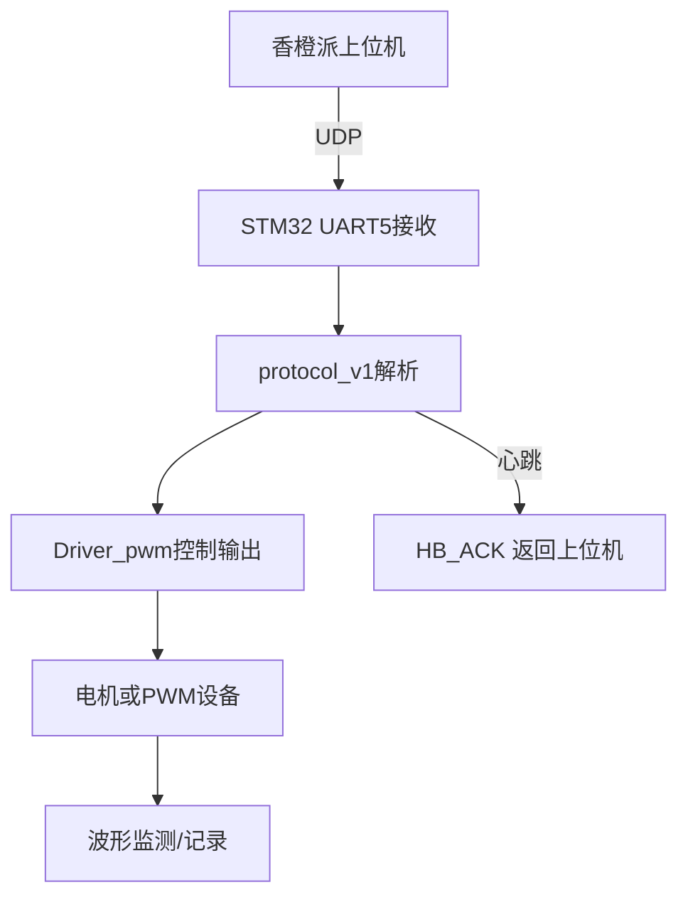

---

# 🧪 系统测试与联调指南（`docs/test_plan.md`）

**项目名称：** 香橙派与 STM32 双机 PWM 控制系统
**版本号：** v1.0
**作者：** 王雨舒,王立
**更新日期：** 2025-11-11

---

## 1️⃣ 测试目标

1. 验证 **通信协议稳定性**（UDP + UART5 + CRC16）。
2. 验证 **PWM 输出正确性**（8 路独立输出、斜率限幅、死区保护）。
3. 验证 **心跳机制**（断链自动进入中位保护）。
4. 熟悉 **编译、烧录、部署** 流程，为后续项目升级打下基础。

---

## 2️⃣ 测试准备

### 硬件清单

| 设备                      | 数量 | 说明                |
| ----------------------- | -- | ----------------- |
| 香橙派（OrangePi 3B/5）      | 1  | 作为上位机，运行 UDP 控制程序 |
| STM32F407/STM32F446 开发板 | 1  | 下位机，负责PWM输出       |
| 网线（RJ45）                | 1  | 上位机 ↔ STM32网口模块   |
| USB转TTL模块               | 1  | STM32调试口监控输出      |
| 电机/舵机 或 示波器             | ≥1 | 验证PWM输出波形         |
| 电源模块（12V / 5V）          | 1  | 为系统供电             |

---

## 3️⃣ 软件环境准备

### 3.1 STM32 侧

* **开发工具：**  Keil uVision5
* **编译器：** version 5
* **固件包版本：** STM32 HAL v1.26+
* **目标芯片：** STM32F407
* **通信接口：** UART5（经下层串口转网口）


确保配置：

* `USART5` 启用 DMA 接收 (`ReceiveToIdle DMA`)
* `TIM1` 和 `TIM4` 启用 PWM 输出模式
* `System Clock` ≥ 84MHz
* `FreeRTOS` 暂不启用（如需可后续加入）

---

### 3.2 香橙派 侧

**操作系统：** Armbian / Ubuntu 20.04
**编译工具链：**

```bash
sudo apt update
sudo apt install cmake g++ git
```

**编译步骤：**
清理原工程中的编译中间文件
``` bash
cd ~/orangepi_send
rm -rf build
mkdir build
cd build
cmake ..
```

```bash
cd orangepi_send
mkdir build && cd build
cmake ..
make -j4
```

生成可执行文件：

```
build/orangepi_send
```

运行方式：

```bash
./orangepi_send 192.168.2.16 8000 51 1
```

含义：

* 目标 IP：STM32 网口地址
* UDP端口：8000
* 控制频率：51Hz
* 心跳频率：1Hz

---

## 4️⃣ STM32 程序编译与烧录

### 4.1 编译步骤

在 keil5

1. 打开项目 `receive_pwm_stm32`
2. 菜单栏选择 **Project → Build Project**
3. 检查控制台输出无 Error，仅 Warning 可接受

### 4.2 烧录步骤

* 使用 ST-Link 连接开发板；
* 在 keil5 中点击 **Download**
* 烧录后开发板自动运行。

### 4.3 串口调试

连接 UART1 调试口，使用任意串口助手查看调试输出：

```
115200 8N1
```

预期输出：

```
[INFO] System Init OK
[INFO] UART5 Ready
[INFO] Waiting for heartbeat...
```

---

## 5️⃣ 功能验证步骤

### 5.1 心跳验证（通信链路）

1. 启动香橙派端程序；
2. STM32 在 1 秒内回复 `HB_ACK`；
3. 终端打印：

   ```
   [HB_ACK] seq=xx rtt=3.10 ms ticks_remote=xxxxxx
   ```
4. 若断开上位机网络，约 0.5 秒后 PWM 输出回中位。

✅ **判定标准：**

* RTT < 10ms；
* 心跳丢失后PWM恢复中位；
* CRC错误帧被自动丢弃。

---

### 5.2 PWM 输出验证

1. 在 `main.cpp` 中设置固定PWM数组：

   ```cpp
   pwm = {500, 2000, 3000, 4500, 5000, 6000, 7000, 9999};
   ```
2. 启动上位机；
3. 使用示波器或舵机测试 8 路输出：

   * 周期应为 **20ms**
   * 脉宽随通道数据线性变化
4. 修改值范围测试 ±10%、±30%、±50%；
5. 验证斜率限幅（电机不应突跳）。

✅ **判定标准：**

* PWM 线性响应；
* 输出稳定；
* 改变值时平滑过渡；
* 死区保护（中位 ±20μs）有效。

---

### 5.3 异常与恢复测试

| 测试项      | 操作     | 预期结果            |
| -------- | ------ | --------------- |
| 通信断开     | 拔掉网线   | 500ms 内全部通道中位   |
| 恢复通信     | 重新插入网线 | 恢复正常输出          |
| CRC 错帧   | 修改发送数据 | STM32 忽略帧，不输出异常 |
| STM32 重启 | 重新上电   | 初始化输出中位，再等待心跳   |

---

## 6️⃣ 说明文档撰写规范

交接后每位开发人员应编写以下文档（放入 `/docs` 目录）：

| 文档名                      | 内容要求                  |
| ------------------------ | --------------------- |
| `test_log_YYYYMMDD.md`   | 每次测试的环境、参数、结果、发现的问题   |
| `hardware_mapping.md`    | 实际接线、定时器通道、PWM引脚说明    |
| `firmware_change_log.md` | 每次固件修改记录（版本、日期、说明）    |
| `troubleshooting.md`     | 常见问题与解决方案（如波形异常、通信中断） |

### Test_log

```
## 测试日期
2025-11-11

## 测试内容
验证PWM输出与心跳机制

## 环境
- STM32F407VET6(串转网模块IP：192.168.2.16：8000)
- 香橙派5 (IP 192.168.2.24)
- 电源 12V
- keil uVision5

## 结果
- 心跳RTT: 3~6ms
- PWM波形稳定，周期20ms
- 断开后0.45s自动中位恢复
- 无CRC错误

## 问题
- pwm频率需要设置为51hz，心跳包设置为1hz。目的是避开Pwm数据与心跳包数据同一时刻发送

---

## 7️⃣ 验收标准

| 测试项   | 验收条件                 | 状态 |
| ----- | -------------------- | -- |
| 心跳机制  | 连通时ACK稳定返回，断线0.5s内中位 | ☐  |
| PWM输出 | 8通道正常响应，无毛刺          | ☐  |
| CRC校验 | 异常帧丢弃，系统无死机          | ☐  |
| 功率设备  | 电机响应正常，无过流过载         | ☐  |
| 重启恢复  | 系统复位后可恢复正常通信         | ☐  |

---

## 8️⃣ 后续扩展建议

1. 在协议层加入：

   * `MSG_STATUS`（状态上报）
   * `MSG_ESTOP`（紧急停止）
2. 添加 `IWDG` 看门狗；
3. 引入 FreeRTOS，将通信与控制任务分离；
4. 上位机端实现自动日志记录与错误报警；
5. 编写自动化测试脚本（Python UDP 模拟器）。

---

## 9️⃣ 附录：推荐工作流程



---